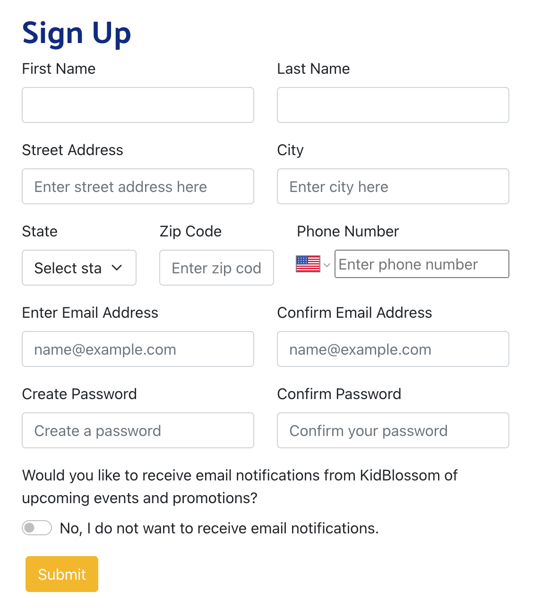
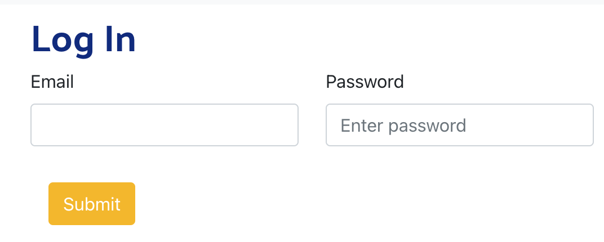
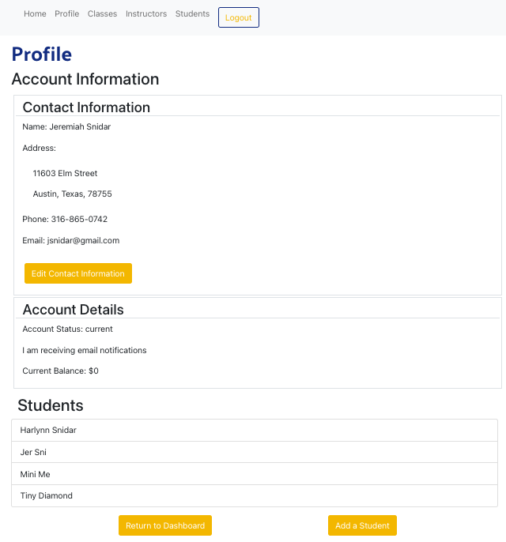
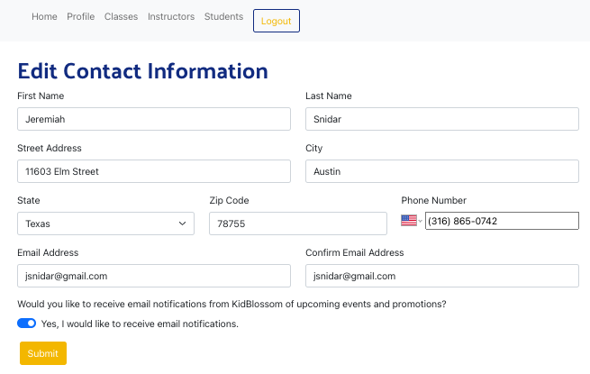
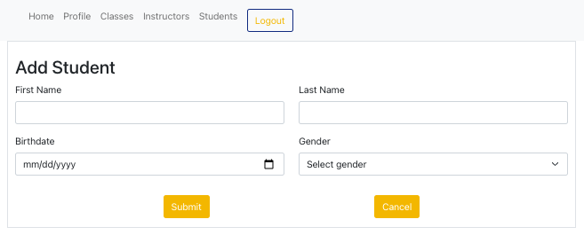
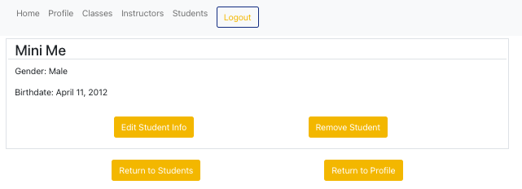

# Kidblossom Guitar School

## Description

Welcome to the Kidblossom Guitar School application. This application has three types of users: clients, instructors, and administrators. The application allows the school to manage enrollment and registration for classes. 

Here is a <a href="https://drive.google.com/file/d/15ONVqw9Ky8QoN0kUwKl0K9BSZQ5pMmxV/view?usp=sharing">link</a> to a video description of the application.

## Roles

### Client

Clients are parents of students enrolled in the school. They have the ability to: 
<ul>
 <li>add students to their account</li>
 <li>edit their students</li>
 <li>remove students from their account</li>
 <li>update their contact information</li>
 <li>view their students' instructors</li>
 <li>view their students' classes</li>
</ul>

### Instructor
Instructors teach guitar classes at the school. They have the ability to:
<ul>
 <li>create, schedule and edit their classes</li>
 <li>add and remove students from their classes</li>
 <li>view their students' information</li>
</ul>

### Administrator
Administrators have the ability to create, edit and remove users and classes. They can: 
<ul>
 <li>create, schedule and edit classes for all instructors</li>
 <li>add and remove students from classes</li>
 <li>create, edit and remove instructors</li>
 <li>create, edit and remove clients</li>
 <li>create, edit and remove students</li>
</ul>

## Usage

To use the application go to <a href="https://kidblossom-guitar-school.herokuapp.com/">https://kidblossom-guitar-school.herokuapp.com/</a>.

There is a client account set up that you can try: 
<ul>
  <li>Email: test@gmail.com</li>
  <li>Password: abcd</li>
</ul>

Below are the client views with a description of each view. 

### Sign Up

Clients can create an account by completing the sign up form.

### Log In
Clients can log in to their account. 

### View Account Information in their Profile
Users can view their contact information as well as their students from the profile page. They can also return to the dashboard, add students to their account and edit their contact information. By clicking on a student they will see details about that student. 

### Update Account Information
Users can update their account information using the Edit Contact Information form. 

### Create/Update/Delete Students

#### Adding a Student
Users can create a new student by clicking the Add Student button in the Profile page. They can also select the View Students button on their Dashboard and then click the Add a Student button. This will take them to the Add Student Form where they can add details for the student they want to add. 

#### Editing a Student

To edit a student, the user clicks on that student in any list of students. This will navigate them to the student details page for that student. 

 They can edit the student by clicking the Edit Student Info Button, which will take them to a form to edit information about that student. 

#### Removing a Student

On the student details page they can remove the student by clicking on the Remove Student button.